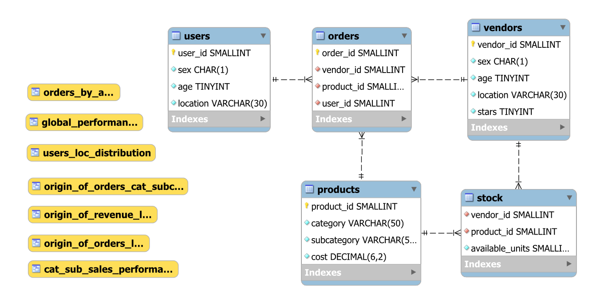
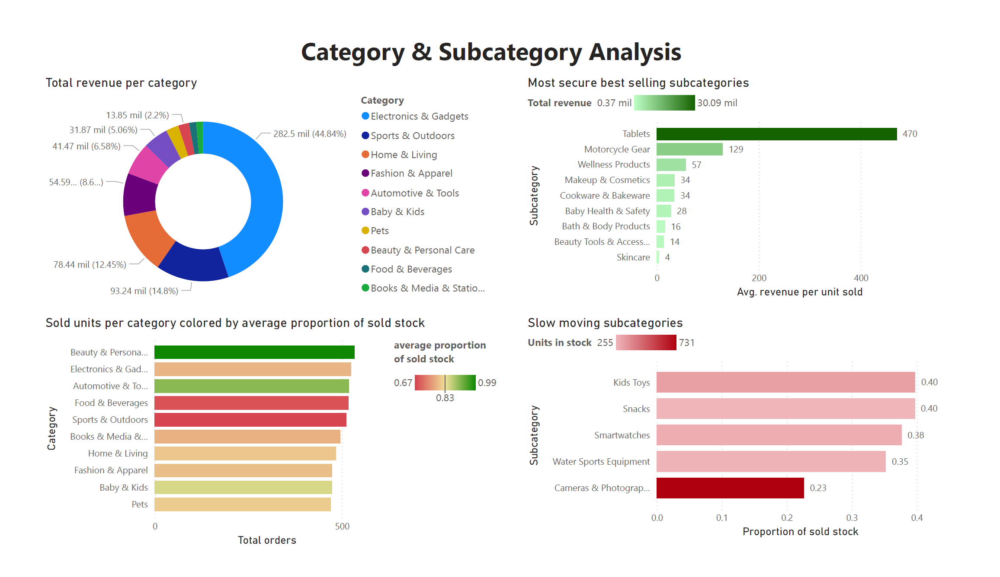
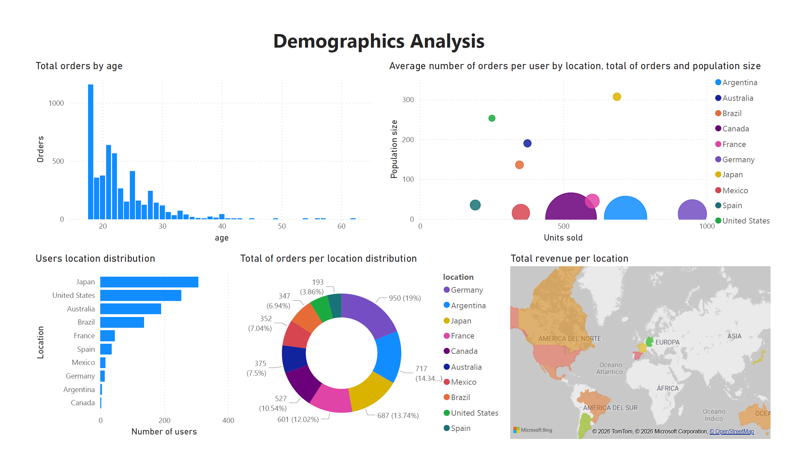

# A Generative Model For Online Store Operations

Operations from a fictitious online store are simulated with data about users, vendors, products, stock and orders, which are randomly generated under several parametric distributions. In particular, orders are created by random sampling from a stock-conditioned probabilistic model, expressed by the chain rule of probability, that is used to determine the user, product and vendor that are involved in the transaction. After this, the stock is updated and the process is repeated as many times is needed. Hence, the online store dynamics are modeled by a complex Markov Chain on the stock values.

A MySQL database is created to model the online store state and transactions, and a simple PowerBI dashboard is created synchronized to some views associated to the databse to visualize relevant insights about the clients, products and transactions.

## Index
1. [Introduction](#introduction) 
2. [Generating the data](#generating-the-data) 
3. [Modeling the joint distribution](#modeling-the-joint-distribution) 
4. [Sampling from the joint distribution](#sampling-from-the-joint-distribution) 
5. [MySQL Database](#mysql-database) 
6. [PowerBI Dashboard](#powerbi-dashboard)
7. [Config & Execution](#config--execution)

## Introduction

Let $\mathcal{S}$ be a fictitious online store with $n_{\text{u}}$ users, $n_{\text{v}}$ vendors, and $n_{\text{p}}$ products. Each user and vendor is identified by ID, gender, age, and location. In addition, vendors are rated using a five-star system. Each product is identified by ID, price, and a classification in category and subcategory. Furthermore, each product type can be offered by several vendors in different quantities and at different costs, composing the store’s initial stock. Orders consist of a triplet: user ID, product ID, and vendor ID. They are conditioned on the current stock and the user’s demographics. The store’s stock is updated by selecting a vendor according to a decision process based on the product’s price distribution, vendor ratings, and a small amount of randomness, after which the selected vendor’s stock for that product is reduced by one unit.

Let $C$ be the set of categories and for each $c\in C$ define $S_c$ as the set of subcategories from $c$. Let $L$ be the set of locations and $G$ the set of genders. We may say that the tuple $`\left(C,\left\{S_c\right\}_{c\in C},L,G,n_{\text{u}},n_{\text{v}},n_{\text{p}}\right)`$ represents the hyper-parameters of $\mathcal{S}$, and when implemented must be user-provided.
    
## Generating the data

### Users
For each country $l\in L$ and gender $g\in G$ we determine an *age scale* parameter $\lambda_{l,g}$ by random sampling from $\mathcal{N}(6,4)$ and taking its absolute value, in order to control the spread of the age distribution. After this, a *preference* parameter $\tau\sim\text{Dirichlet}(1_{|L|})$ is introduced to determine the number of users per location. In addition to this, *gender inbalance* per each location $l\in L$ is modeled by $i_{l}\sim\mathcal{N}(0.5,0.01)$. Hence, the vector $n\sim\text{Multinomial}(n_{\text{u}},\tau)$ determines the number of users per location, and if $n_j$ is related to location $l$ then $n_{l,\text{m}} = \lfloor n_ji_l\rfloor$
determines the number of males in $l$ and $n_{l,\text{f}} = n_j - n_{l,\text{m}}$ determines the number of females in $l$. Finally, we model the age distribution for each location $l\in L$ and gender $g\in G$ by random sampling $n_{l,g}$ observations from $\text{Exponential}(18,\lambda_{l,g})$ and taking its absolute value (note that the displacement parameter is set to 18, as we assume that only adults can be registered to the store). Such generated values fill the users table as follows.

Each users table row consists of a tuple $(\text{user ID, location, gender, age})$ where user IDs are randomly assigned without replacement from $\{1,\dots,n_{\text{u}}\}$.

### Vendors
The vendors table is generated with exactly the same procedure than the users table, but with the addition of a 5-star rating value for each vendor. The number of stars is assigned randomly from $\{1,\dots,5\}$ under a $\text{Categorical}((0.05, 0.1, 0.25, 0.3, 0.3))$ distribution.

Each vendors table row consists of a tuple $(\text{vendor ID, location, gender, age, stars})$ where vendor IDs are randomly assigned without replacement from $\{1,\dots,n_{\text{v}}\}$.

### Products
For each $c\in C$ define $\kappa_c$ as the mean price of products in category $c$. Now, for each subcategory $s\in S_c$ let $\bar\kappa_{c,s}\sim\text{Gamma}(\kappa_c/20,1/20)$ be the mean price of products in subcategory $s$. In analog to the users and vendors tables, we define a *preference* parameter $\tau\sim\text{Dirichlet}\left(1_{\sum_{c\in C}|S_c|}\right)$ to determine the number of products per subcategory with the vector $n\sim\text{Multinomial}(n_{\text{p}},\tau)$. Finally, for each $c\in C$ and $s\in S$, if $n_j$ is the number of products from category $c$ and subcategory $s$ then we generate a sample of $n_j$ observation from $\text{Gamma}(\bar\kappa_{c,s}/2,1/2)$ which will be used to fill the products table.

Each products table row consists of a tuple $(\text{product ID, category, subcategory, price})$ where product IDs are randomly assigned without replacement from $\{1,\dots,n_{\text{p}}\}$.

Note that the selected gamma distributions have such form to ensure the price expected value is conserved per category after generating samples of such hierarchical structure.

### Stock
Suppose that each vendor has a diversified stock of products on each category, but still have some preferences for ones over others. To model this, for each category $c\in C$ define $\tau_c\sim\text{Dirichlet}(1_{n_{\text{v}}})$ as some vendor preference indicator for each category. Now, for each $c\in C$ and $s\in S_c$ let $n_{c,s}$ be its respective number of products generated in the step before, and define $m_{c,s}\sim\text{Multinomial}(n_{c,s},\tau_c)$ as the stock distribution of $(c,s)$-products on vendors. In addition, if $W_{c,s}$ is the set of all product IDs that are associated to $c$ and $s$ then we randomly assign without replacement $m_{c,s,1}$ to the first vendor, and use the remaining IDs to sample without replacement $m_{c,s,2}$ for the second one, and so on. Finally, we group the generated relationships by vendor ID and product ID, and count the number of occurrences, such value will be named as the *available units*.
    
Hence, each stock table row consists of a tuple $(\text{vendor ID, product ID, available units})$.

### Orders
In order to generate random valid orders for the store, lets define $(x_1,\dots,x_5)$ as a valid combination of a category, subcategory, gender, location and age respectively (i.e. that such combination exists in the generated data). For notation simplicity, define $\theta_0\in\mathbb{Z_+}^{\text{Num. product IDs}}$ as a vector representation of the stock of all products in the store. In addition, let $I_c$ be the set of indices from $\theta$ that are associated to category $c$, and $I_{c,s}$ be the set of indices from $\theta$ that are associated to category $c$ and subcategory $s$.

For each valid category $c$ and subcategory $s$ we rate its products, sold by all the non-zero stock vendors filtered by $c$ and $s$, by the following formula

$$\text{Rating = MinMaxScale(vendor's stars) - MinMaxScale(price) + Random Noise}$$

The idea is that users will generally prefer to buy the cheapest product from their interest (represented by the product ID) from the vendor with the highest number of stars. In order to account for the scenarios where this reasoning does not apply due to non-considered decision factors such as importation taxes or delivery time, we add some little random noise given by $\mathcal{N}(0,0.04)$. 

Therefore, if we sample $(x_1,\dots,x_5)$ from the joint distribution $p(x_1,\dots,x_5|\theta)$ then a random user from gender $x_3$ located at $x_4$ with $x_5$ years old will buy a product from category $x_1$ and subcategory $x_2$. Such product and its corresponding vendor will be selected as the ones that maximize its rating value. If the selected product is associated to the stock vector representation index $i$ then $\theta_{i} \leftarrow \theta_{i} - 1$ and the decision process may be repeated as many times as needed.

Thus, each orders table row consists of a tuple $(\text{order ID, vendor ID, product ID, user ID})$  where order IDs are assigned sequentially from $1$ to $n_{\text{o}}$, the total number of orders.

## Modeling the joint distribution
To address the unknown joint probability distribution $p(x_1,\dots,x_5|\theta)$ we will factor it appropriately by applying the chain rule of probability as follows
$$p(x_1,\dots,x_5|\theta) = p(x_1|\theta)p(x_2|x_1,\theta)p(x_3|x_2,x_1)p(x_4|x_3,x_2,x_1)p(x_5|x_4,\dots,x_1)$$
Note that only the first two terms depend on the stock, as these are the conditional distributions on categories and subcategories, so if the stock from one of them is empty, the probability must dynamically be set to zero. For simplicity, we will not consider all dependencies when defining the conditional distributions and may consider other depe

Let $p(x_1)$ be some prior distribution on the categories and $p(\theta|x_1) = \frac{1}{n_p}\sum_{i\in I_{x_1}}\theta_i$ be the likelihood, hence the posterior distribution is given by

$$p(x_1|\theta) = \frac{p(x_1)\sum_{i\in I_{x_1}}\theta_i}{\sum_{c\in C}p(c)\sum_{j\in I_{c}}\theta_j}$$

Similarly, for each category $x_1\in C$ let $p(x_2|x_1)$ be some prior distribution on the subcategories from category $x_1$ and $p(\theta|x_1,x_2) = \frac{1}{n_p}\sum_{i\in I_{x_1,x_2}}\theta_i$ be the likelihood, hence the posterior is modeled by

$$p(x_2|x_1,\theta) = \frac{p(x_2|x_1)\sum_{i\in I_{x_1,x_2}}\theta_i}{\sum_{s\in S_{x_1}}p(s)\sum_{j\in I_{x_1,s}}\theta_j}$$

For simplicity, suppose $p(x_3|x_2,x_1) = p(x_3|x_1)$ so we just have to model dependencies on a small number of categories, instead of a giant number of subcategories.

Let $p(x_4)$ be a prior distribution on locations and $\phi(x_4,x_3)$ determine the number of users from location $x_4$ and gender $x_3$ so the likelihood is given by $p(\phi|x_4,x_3) = \frac{\phi(x_4,x_3)}{n_\text{u}}$. Thus, the posterior has the form

$$p(x_4|x_3,\phi) = \frac{p(x_4)\phi(x_4,x_3)}{\sum_{l\in L} p(l) \phi(l,x_3)}$$

Let $p(x_5|x_4,x_3)$ be a prior distribution on ages from location $x_4$ and gender $x_3$. For each $g\in G$ and $l\in L$, let $A_{g,l}$ be the set of all valid ages from gender $g$ in location $l$. If $\psi(x_5,x_4,x_3)$ determines the number of users from location $x_4$, gender $x_3$ with $x_5$ years old, then the likelihood is given by $p(\psi|x_5,x_4,x_3) = \psi(x_5,x_4,x_3) / \sum_{a\in A_{x_3,x_4}}\psi(a,x_4,x_3)$. Hence, the posterior distribution is given by

$$p(x_5|x_4,x_3,\psi) = \frac{p(x_5|x_4,x_3)\psi(x_5,x_4,x_3)}{\sum_{a\in A_{x_3,x_4}}p(a|x_4,x_3)\psi(a,x_4,x_3)}$$

| prior                | expression                                                                 |
|----------------------|----------------------------------------------------------------------------|
| $p(x_1)$             | $`\mathrm{Uniform}(C)`$                                                    |
| $p(x_2 \mid x_1)$    | $`\mathrm{Uniform}(S_{x_1})`$                                              |
| $p(x_4 \mid x_3)$    | $`\mathrm{Dirichlet}(5 \cdot 1_{\lvert L\rvert})`$                         |
| $p(x_5 \mid x_4,x_3)$| $`\mathrm{Softmax}\!\left(\psi(a,x_4,x_3)\right)_{a \in A_{x_3,x_4}}`$     |

Therefore, the joint distribution is completely modeled by

$$p(x_1,\dots,x_5|\theta,\phi,\psi) = p(x_1|\theta)p(x_2|x_1,\theta)p(x_3|x_1)p(x_4|x_3,\phi)p(x_5|x_4,x_3,\psi)$$

## Sampling from the joint distribution

Note that the valid combinations of category, subcategory, gender, location and age are finite and the joint distribution can be factored in a hierarchical model that has the form of a tree structure. Each level from the tree represents a set of all possible states from the ones mentioned above, in the same order, and the nodes represent its elements. The edges may be weighted by the probabilities from the current level distribution, conditioned on the nodes that uniquely connect it to the root. See the following figure for an example of this.

Hence, the outermost level (the leaf nodes) represent all the possible valid combinations, and the probability of reaching a specific node in this level, from the root is equal to the joint probability of such state. In order to quickly determine such probabilities, let's represent the system by a transition matrix $P(\theta)$ associated to the weighted tree (for a real implementation, we must consider using a sparse array) and if the root is indexed by 1, then part of the first row of $P(\theta)^5$ will contain such probabilities $\pi(\theta)$. Finally, sampling from $\text{Categorical}(\pi(\theta))$ and decoding the valid combination $(x_1,\dots,x_5)$ that such node is associated with, is equivalent to sampling from the theoretical joint distribution.

## MySQL Database

This is not a database-focused project, but MySQL is used as an intermediary between the data generation process and the PowerBI dashboard. The system depends on a unique MySQL database composed by only 5 tables and 7 views, which are the ones connected to PowerBI and can be dynamically updated. The MySQL Workbench EER diagram tool was used to create the following image.

Once all the data is generated (usres, orders, products, stocks and transactions), the corresponging INSERT queries are executed to fill the database. Finally, the [create_views.py](generation/create_views.sql) file is executed, which create 7 views with relevant information about the database, as context-specific aggregations to sumarize transactions and people information. Now, PowerBI is ready to connect to the databse and access the final data.

## PowerBI Dashboard

The dashboard is composed by two pages. The first page provides a Category & Subcategory Analysis to identify performance patterns across the product portfolio.

It begins with a total revenue per category donut chart, which highlights the contribution of each category to overall revenue. This helps to identify the dominant segments and those with a low financial impact.

To the right, the dashboard displays the most secure best-selling subcategories, combining total revenue and average revenue per unit sold. This visualization helps detecting high value subcategories that generate strong income.

Below, a bar chart shows sold units per category colored by the average proportion of stock sold, integrating demand and inventory performance into a single view. The color scale indicates stock efficiency, identifying the categories that require restock and the ones that are not selling well.

Finally, the slow-moving subcategories section focuses on items with high stock and high remaining inventory levels. Basically, this are the worst of the worst selling products, and is key to identify the subcategories that require new promotional strategies or pricing adjustments.

The second page focuses on Demographics Analysis, providing insights into customer behavior across age groups and geographic locations.

It begins with the total of orders by age distribution, which remarks purchasing activity across different ages and helps to identify the most active customer segments.

Next, a bubble chart presents the average number of orders per user by location, integrating three dimensions: units sold (x-axis), population size (y-axis), and total orders (bubble size). This visualizes the market volume across countries, identifying regions with strong purchasing intensity relative to their user base.

The users location distribution bar chart provides a clear overview of customer concentration by country, showing where the platform has the largest user base. This helps to identify high sales produced by large populations and those produced by higher per-user activity.In addition, the total orders per location distribution donut chart shows each country’s contribution to overall order volume.

Finally, the total revenue per location map delivers a geographic perspective on financial performance. This identifies high-revenue regions and potential growth markets.

## Config & Execution

To run this program, you only have to fill the MySQL user credentials in the [db_config.py](config/db_config.py) file. Feel free to modify the follwowing parameters in the [gen_cofig.py](config/gen_config.py) file, whose default values are set to

    N_USERS = 1000
    N_VENDORS = 200
    N_PRODUCTS = 10000
    N_ORDERS = 5000

After this, the configuration is complete and you may run with confidence
    
    python main.py
